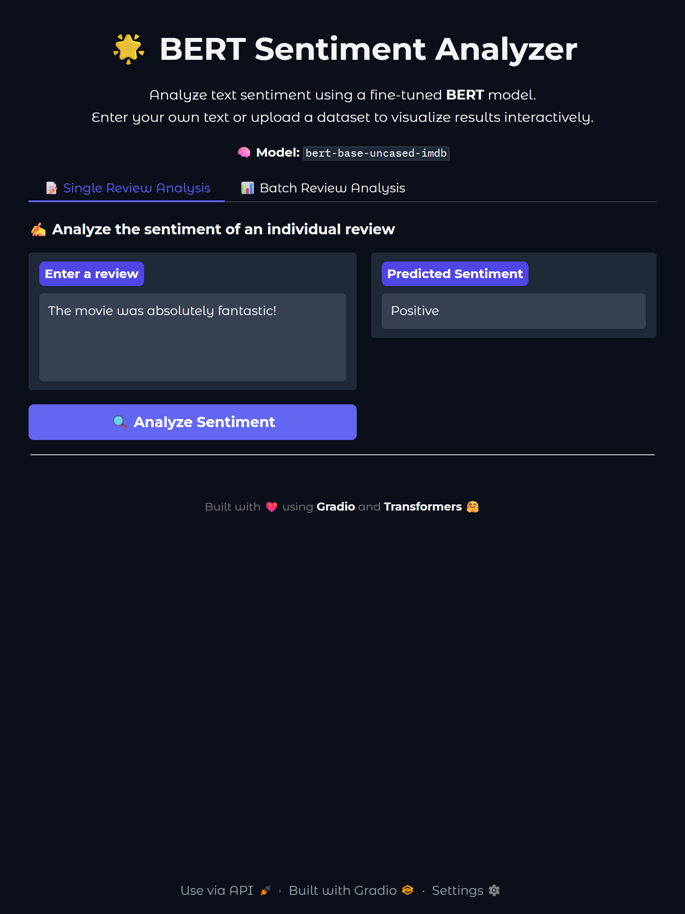

<p align="center">
  
</p>

<h1 align="center">📘 BERT Sentiment Analyser</h1>

<p align="center">
  <strong>A production-ready Sentiment Analysis system using a fine-tuned BERT model.</strong>
</p>

<p align="center">

  <!-- Badges -->
  
  
  
  
  
</p>

---

# 📝 Overview

This project is a **Sentiment Analysis Application** built using a **fine-tuned BERT model** on the **IMDB movie reviews dataset**.

- The model is trained via the **Hugging Face Trainer API (3 epochs)**  
- Performs **binary sentiment classification** (Positive / Negative)  
- Includes an intuitive **Gradio UI** and **Docker deployment**  

---

# 🚀 Features

- 🔍 **Sentiment Prediction** for individual or batch reviews  
- 📊 **Charts**: Bar chart, pie chart & confidence visualization  
- ☁️ **Word Cloud** generation  
- 📁 **CSV Upload** support for bulk review analysis  
- 🧩 **Modular Model Architecture**  
- 🐳 **Docker Support** for simple deployment  
- 🖥️ **Easy-to-use Interface** built with Gradio  

---

# 🖼️ Screenshots

<details>
  <summary><strong>📌 Click to expand UI Screenshots</strong></summary>
  <br>

  ### 🔹 Home Interface (Gradio UI)
  <p align="center">
    
  </p>

  ### 🔹 Sentiment Analysis Output & Word Cloud Visualization
  <p align="center">
    
  </p>

</details>


---


# 📂 Project Structure

````
📦 BERT-Sentiment-Analyzer
│
├── sentiment_analyser.py      # Model class (modular + reusable)
├── app_interface.py           # Gradio UI
├── requirements.txt           
├── Dockerfile                 
├── .dockerignore              
├── README.md                  
├── assets/                    # screenshots or icons
└── BERT_Fine_Tuning.ipynb     # Notebook used for fine-tuning 

````

# ⚙️ Setup Instructions

1️⃣ Clone the repository
```bash
git clone https://github.com/BhagwatiOracle/BERT-Sentiment-Analyser.git

cd BERT-Sentiment-Analyser
```

2️⃣ Create a virtual environment
```bash
python -m venv venv

source venv/bin/activate     # Windows: venv\Scripts\activate
```

3️⃣ Install dependencies
```bash
pip install -r requirements.txt
```

4️⃣ Run the app

```bash
python app_interface.py
```


# 🐳 Run With Docker

1️⃣ Build image
```bash
docker build -t sentiment-app .

```
2️⃣ Run container
```bash
docker run -p 8000:8000 sentiment-app

```
3️⃣ Open Browser
```
http://localhost:8000

```
---
# ⭐ Contributing

Pull requests are welcome!
Feel free to open issues for improvements.


